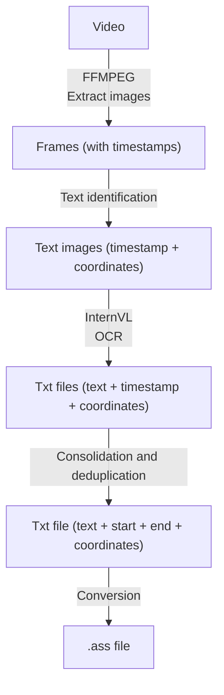

# Subtitles OCR

A harcoded subtitles extractor

## Usage

1. Install

```bash 
# Choose the right hardware configuration depending on your environment.
# See https://github.com/GeoffreyCoulaud/uv-pytorch-template
uv pip install -e '.[cpu]' # Or cu129, rocm, xpu
```

2. Run scripts

```bash
# Extract frames from a video
uv run extract-frames <video_path> <output_dir>
```

## Adding New Scripts

1. Create your script in `src/main/scripts/`
2. Add an entry point in `pyproject.toml` under `[project.scripts]`
3. Run `uv sync --dev` to update the environment

## Architecture

The goal of this project is to have separate steps, all of them acting on one input, and outputting 0 to N outputs.  
No parallelization work is done in the scripts, that's reserved for the user to choose how they want to run the scripts.  
Why ? Because debugging parallelized applications is a chore.

> Premature optimisation is the root of all evil  
\- *Aristotle, probably*

The overall architecture is as follows:



Notes
- Timestamps are formatted as `HH:MM:SS,mmm`
- Coordinates are integer 4-tuples of `x,y,width,height`
- When metadata is added to files, it is contained in the filename